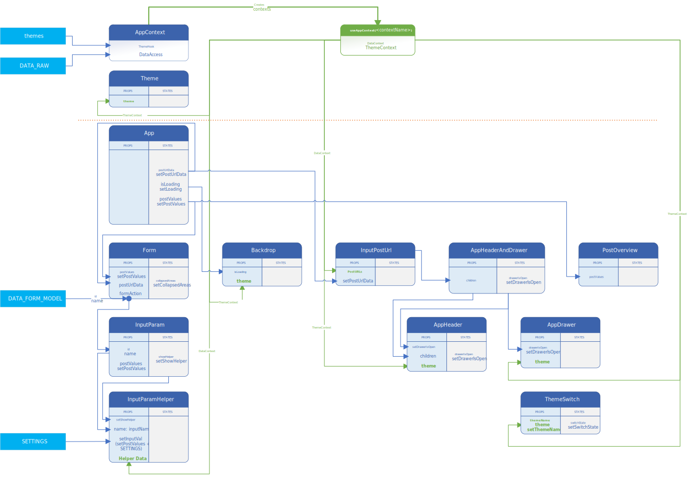

# HPP demo page

**React** + **Material UI** application that allows the user to create, configure the body and submit a POST request.

> **`DATA_RAW.js`** is not available inside this repository for security reasons

### Functionalities so far:
- *< to be updated >*
- ***UI*** - dark/ligt mode theme switch
- ***UI*** - added `<OverviewPost>` that displays the request's body for the POST to be submitted (params alphabetically ordered)
- toggle accordion areas based on POST URL value (`<InputPostUrl>`) and `FORM_DATA_MODEL` from ***src/data/FormDataModel.js***
- connect **POST URL** list value to **MerchantID helper** list
- handle **MerchantID** and **SiteID** value when POST URL value changes
- connect **MerchantID** value to **SiteID helper** list
- display form sub-areas titles according to `FORM_DATA_MODEL` (before the first input assigned to that sub-area)
- ***UI*** - add POST URL (form action) to `<OverviewPost>`
- handle inputs that are not payment params (ignore from POST body, add value to input)
- add tooltips to inputs according to FORM_DATA_MODEL and param type
- generate new MTID on POST URL value change and on input label click
- set **Signature** value according to POST URL / **MerchantID** / **SiteID** combination
- update **ComputedString** for all param changes
- remove **Signature** and **ComputedString** from AppHelpers / PostValues objects
- handle **Hash**
- change the order of params inside request body based on `FORM_DATA_MODEL`
- handle submit
- send only specified params in request
- specify a custom POST URL as form action
- set form inputs value by URL params
- ***UI*** - use Material UI list to upgrade POST URL dropdown list
- ***UI*** - add a Material UI dialog component to a new context to be available when actions inside other componetns need confirmation dialogs
- add Material UI alerts engine to app
- HistoryList - save all submitted requests to localStorage and display them as a Material UI list inside right drawer
- HistoryList - ***UI*** - history list -> add scrollbar and handle right drawer's width on smaller breakpoints + convert confirmation alert to Material UI dialog
- HistoryList - add 'Delete All' action
- HistoryList - ***UI*** - add custom scroll bar to history component
- HistoryList - add 'View History for a specific period' action + add date-time range picker + validations + UI feedback
- move logic regarding "URLparams" from `<App>` + useEffect(... setPostValues(...),[]) to affecting initial values for "postValues" and "postUrlData" when they are created (correct usage of React lifecycle events)
- handle `postUrlName` sent as an URL param
- handle all text helpers
- add image helper for methods
- add methods list helper to toggle sort order display name / id
- create a **Form Data Model Access** layer -> and move/use all queries regarding form data model to it

### Functionalities to come:

- ***UI*** - params picker - add drawer with params list for smaller breakpoits
- ***UI*** - params picker - add alert for adding/removing params from post
- add + handle default values for transaction type
- add + handle default values for post URL
- REFACTORY after `FORM_DATA_MODEL` has transaction type for all params (should move `transactionType` status to `<App>` and refactory the display logic for `<Form>` and `<FormArea>` + refactory for effects inside `<InputParam>` and `<InputParamHelper>`)
- HistoryList - save and apply transaction type
- HistoryList - stop using confirmation provider as a Material UI provider when selecting period (to be able to disable OK btn on err)
- History list -> add 'Delete for Period'
- set form action value by URL params
- ***UI*** - move `<OverviewPost>` and `<OverviewApp>` to a Material UI permanent right drawer that collapses on smaller breakpoints
- handle exotic actions (payout, refund, recurrent, capture, cancel)
- add MTID generator helper as an icon integrated inside input
- add custom actions with icons to inputs (clear input, generate random val, etc)
- save and restore form data from **localStorage**
- ***UI*** - move inputs that are not payment params related to the left drawer as actions with icons (**DisplayInsideIframe**, **IframeOverlaySource**)
- ***UI*** - integrate Material UI for `<InputParam>` and `<InputParamHelper>`
- ***UI*** - add live filter to form to search inputs
- ***UI*** - display `postValues` as a UI blocker when submitting form
- make `<OverviewPost>` editable + affect form inputs values
- allow to load and parse a REST message body JSON + display the response
- allow import of postmen collections
- ***UI*** - add POST URL to `<OverviewPost>` (?)
- hide/show inputs according to POST URL value (?)
- add default values to specified inputs according to POST URL value (extend FormDataModel) or select first option from helper (?)

### Issues:
- *< to be updated >*
- if `merchantId` param is found in URL params (does not matter if it has value or not) `<InpuParamHelper>` -> **helperBehaviour()** will not work

### Components overview

v0.2 - 2021/03/10

##### Previous versions:
- [v0.1 - 2021/03/09](https://raw.githubusercontent.com/bogdan-lucaci/react-hpp-demo-page/master/AppDiagram/APP_structure_v0.1.svg)

### ----------

This project was bootstrapped with [Create React App](https://github.com/facebook/create-react-app).

#### Available Scripts

In the project directory, you can run:

##### `npm start`

Runs the app in the development mode.\
Open [http://localhost:3000](http://localhost:3000) to view it in the browser.

The page will reload if you make edits.\
You will also see any lint errors in the console.

##### `npm test`

Launches the test runner in the interactive watch mode.\
See the section about [running tests](https://facebook.github.io/create-react-app/docs/running-tests) for more information.

##### `npm run build`

Builds the app for production to the `build` folder.\
It correctly bundles React in production mode and optimizes the build for the best performance.

The build is minified and the filenames include the hashes.\
Your app is ready to be deployed!

See the section about [deployment](https://facebook.github.io/create-react-app/docs/deployment) for more information.

##### `npm run eject`

**Note: this is a one-way operation. Once you `eject`, you can’t go back!**

If you aren’t satisfied with the build tool and configuration choices, you can `eject` at any time. This command will remove the single build dependency from your project.

Instead, it will copy all the configuration files and the transitive dependencies (webpack, Babel, ESLint, etc) right into your project so you have full control over them. All of the commands except `eject` will still work, but they will point to the copied scripts so you can tweak them. At this point you’re on your own.

You don’t have to ever use `eject`. The curated feature set is suitable for small and middle deployments, and you shouldn’t feel obligated to use this feature. However we understand that this tool wouldn’t be useful if you couldn’t customize it when you are ready for it.
<!---
## Learn More

You can learn more in the [Create React App documentation](https://facebook.github.io/create-react-app/docs/getting-started).

To learn React, check out the [React documentation](https://reactjs.org/).

### Code Splitting

This section has moved here: [https://facebook.github.io/create-react-app/docs/code-splitting](https://facebook.github.io/create-react-app/docs/code-splitting)

### Analyzing the Bundle Size

This section has moved here: [https://facebook.github.io/create-react-app/docs/analyzing-the-bundle-size](https://facebook.github.io/create-react-app/docs/analyzing-the-bundle-size)

### Making a Progressive Web App

This section has moved here: [https://facebook.github.io/create-react-app/docs/making-a-progressive-web-app](https://facebook.github.io/create-react-app/docs/making-a-progressive-web-app)

### Advanced Configuration

This section has moved here: [https://facebook.github.io/create-react-app/docs/advanced-configuration](https://facebook.github.io/create-react-app/docs/advanced-configuration)

### Deployment

This section has moved here: [https://facebook.github.io/create-react-app/docs/deployment](https://facebook.github.io/create-react-app/docs/deployment)

### `npm run build` fails to minify

This section has moved here: [https://facebook.github.io/create-react-app/docs/troubleshooting#npm-run-build-fails-to-minify](https://facebook.github.io/create-react-app/docs/troubleshooting#npm-run-build-fails-to-minify)
--->
